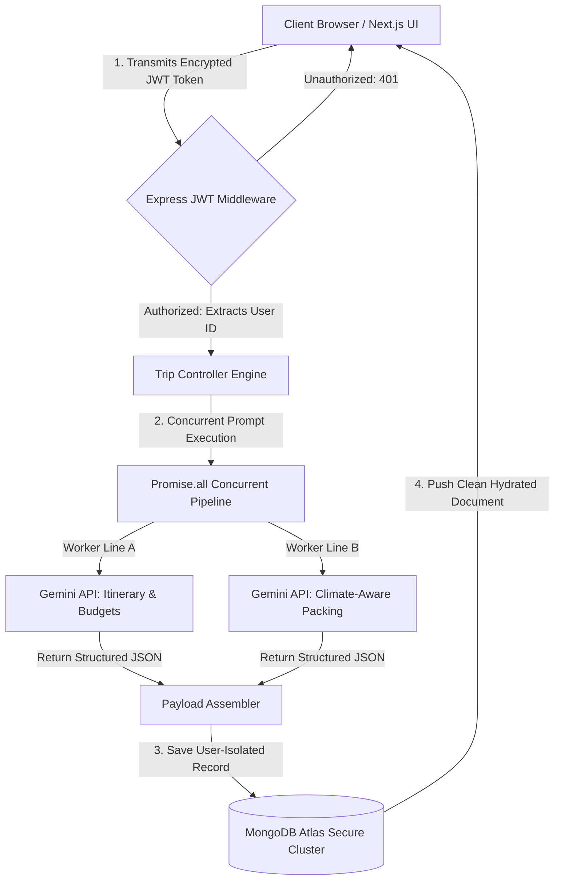

# AI Travel Planner - Secure GenAI Enterprise Architecture

An advanced, multi-user full-stack travel orchestration platform that generates highly customized day-by-day itineraries, regional budget projections, hotel recommendations, and weather-aware packing lists.

Powered by a high-throughput, parallelized Google Gemini LLM engine, the application focuses heavily on strict user data isolation, resilient API design, and a responsive frontend experience.

---

## 🚀 Live Access & Walkthrough

* **Production Deployment:** https://your-app-name.vercel.app
* **Backend API Gateway:** https://your-backend-service.onrender.com
* **Technical Video Walkthrough:** *Insert Link Here*

---

# 🏗️ System Architecture & Data Flow

The platform utilizes a decoupled, asynchronous monorepo architecture.



---

# 🖥️ Frontend Client

### Next.js (App Router) & TypeScript

Selected to enforce strong compile-time type safety across API payloads while leveraging modular routing structures for seamless scalability and maintainability.

### Tailwind CSS

Used to create an accessible, high-contrast dark theme with fully responsive layouts optimized for both mobile and desktop devices.

---

# ⚙️ Backend Infrastructure

### Node.js & Express

Used to construct a high-performance, stateless REST API with clear separation of concerns using the MVC (Models, Views, Controllers) architecture.

### MongoDB & Mongoose

Provides a flexible database environment ideally suited for storing dynamic JSON structures generated by LLM workflows while maintaining strict validation rules.

---

# 🔒 Security Enclave & Multi-User Isolation

To satisfy Zero Trust Data Access principles, user privacy is treated as a non-negotiable requirement.

## Stateless JWT Authentication

Users exchange credentials secured with bcrypt hashing (10 salt rounds) for signed JSON Web Tokens (JWTs).

## Strict IDOR Prevention

The backend completely avoids unverified resource access patterns. Every database query enforces ownership using the authenticated user's token context.

```javascript
const updatedTrip = await Trip.findOneAndUpdate(
  {
    _id: req.params.id,
    userId: req.user.id,
  },
  req.body,
  {
    returnDocument: "after",
    runValidators: true,
  }
);
```

This design completely mitigates Insecure Direct Object Reference (IDOR) vulnerabilities. Users cannot view, modify, or delete another user's travel plans, even if they correctly guess a MongoDB ObjectId.

---

# 🧠 AI Integration, Parallelization & Fault Tolerance

## The Latency Challenge

Traditional LLM workflows often suffer from unnecessary delays due to sequential prompt execution.

To improve responsiveness, the application executes multiple AI tasks concurrently using `Promise.all()`.

### Parallel Prompt Execution

When a user requests a trip, the backend simultaneously sends:

#### Core Planner Prompt

Generates:

* Day-by-day itinerary plans
* Hotel recommendations
* Budget projections
* Travel activity suggestions

#### Weather Packing Assistant Prompt

Generates:

* Climate-aware packing lists
* Destination-specific essentials
* Travel preparation recommendations

This concurrent architecture significantly reduces response latency and allows both payloads to be merged and persisted in a single database operation.

---

## Rate Limit Resilience (Exponential Backoff)

To ensure reliability under heavy traffic, the backend gracefully handles API rate limits using a recursive retry mechanism with exponential backoff.

```javascript
async function fetchWithRetry(url, options, retries = 3, delay = 1000) {
    try {
        const response = await fetch(url, options);
        if (!response.ok) {
            if (response.status === 429 && retries > 0) {
                await new Promise(resolve => setTimeout(resolve, delay));
                return fetchWithRetry(url, options, retries - 1, delay * 2);
            }
            throw new Error(`API Error: ${response.status}`);
        }
        return await response.json();
    } catch (error) {
        if (retries > 0) {
            await new Promise(resolve => setTimeout(resolve, delay));
            return fetchWithRetry(url, options, retries - 1, delay * 2);
        }
        throw error;
    }
}
```

---

# 🎨 Creative Engineering Focus: Climate-Aware Packing Engine

## Problem Statement

Traditional travel applications require users to manually determine clothing, accessories, safety equipment, travel documents, and destination-specific essentials.

This creates unnecessary cognitive overhead and increases the risk of forgetting important items needed for regional climates and travel conditions.

Examples include:

* Thermal wear for Iceland
* Rain gear for tropical destinations
* Universal adapters for international travel
* Health and safety essentials

---

## Solution & Value Delivered

The platform includes a Climate-Aware Packing Assistant that extracts geographic metadata from user travel requests and leverages Gemini to generate destination-specific packing recommendations.

### Frontend Optimization

The feature implements **Optimistic UI Updates**.

When a user checks an item from the packing list:

1. The UI updates immediately.
2. The backend update runs asynchronously.
3. The user receives a fast and fluid experience regardless of network latency.

---

# ⚙️ Local Development Setup

## Backend Setup

Navigate to the backend directory:

```bash
cd backend
npm install
```

Create a `.env` file inside the `backend/` directory:

```env
PORT=5000
MONGO_URI=your_mongodb_connection_string
JWT_SECRET=your_cryptographic_secret
GEMINI_API_KEY=your_google_gemini_api_key
```

Run the development server:

```bash
npm run dev
```

---

## Frontend Setup

Navigate to the frontend directory:

```bash
cd ../frontend
npm install
```

Create a `.env.local` file inside the `frontend/` directory:

```env
NEXT_PUBLIC_API_URL=http://localhost:5000
```

Start the Next.js development server:

```bash
npm run dev
```

Access the application at:

```text
http://localhost:3000
```

---

# 📁 Suggested Project Structure

```text
AI-Travel-Planner/
│
├── frontend/
│   ├── app/
│   ├── components/
│   ├── hooks/
│   ├── services/
│   └── types/
│
├── backend/
│   ├── controllers/
│   ├── middleware/
│   ├── models/
│   ├── routes/
│   ├── services/
│   └── utils/
│
├── docs/
├── README.md
└── package.json
```

---

# 🛠️ Core Features

* 🔐 JWT Authentication & Authorization
* 👥 Multi-User Travel Management
* 🧠 Google Gemini AI Integration
* 📅 Day-by-Day Itinerary Generation
* 💰 Budget Forecasting
* 🏨 Hotel Recommendations
* 🌦️ Climate-Aware Packing Lists
* ⚡ Parallel AI Execution Pipeline
* 🔄 Exponential Backoff & Retry Logic
* 📱 Fully Responsive UI
* 🎯 Optimistic UI Updates
* 🗄️ MongoDB Atlas Persistence
* 🛡️ IDOR Protection & Ownership Enforcement

---

# 🛑 Known Limitations & Technical Debt

## LLM Schema Non-Determinism

Generative AI platforms may occasionally return varying JSON structures for equivalent prompts.

### Planned Improvement

Future versions will enforce strict structured outputs using Gemini JSON Schema configurations to guarantee consistent payload shapes.

---

## Token Expiry Re-Authentication

Currently, users are logged out immediately when their JWT expires.

### Planned Improvement

A dual-token authentication strategy will be implemented:

* Short-lived Access Tokens
* Secure HTTP-Only Refresh Tokens

This will improve both user experience and security.

---

# 🚀 Future Enhancements

* Real-time flight integration
* Hotel booking integrations
* Currency conversion support
* Multi-language itinerary generation
* Offline itinerary downloads
* PDF export functionality
* Push notifications for trip reminders
* Interactive travel maps
* AI-powered travel assistant chat

---

# 📄 License

This project is intended for educational, portfolio, and demonstration purposes.

---

## 👨‍💻 Author

**AI Travel Planner — Secure GenAI Enterprise Architecture**

Built using:

* Next.js
* TypeScript
* Tailwind CSS
* Node.js
* Express.js
* MongoDB Atlas
* Mongoose
* Google Gemini AI
* JWT Authentication
* RESTful APIs
* Optimistic UI Patterns
